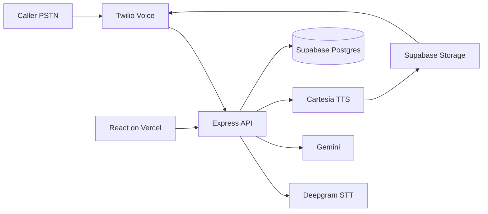

# Leadforces tech stack — non-AWS, free credits, hackathon-simple

Design goals: **no AWS services**, **prefer free tier / starter credits**, **fewest moving parts**, aligned with the [Leadforces PDF](file:///c:/Users/madhu/AppData/Roaming/Cursor/User/workspaceStorage/ed6b7b7106c8485b0e4eb46470153714/pdfs/fcd0cc17-a3ac-41a0-9127-c67740642177/leadforces_tech_stack.pdf) voice loop, scoring, and dashboard — **without** Salesforce/HubSpot or any CRM push. **LLM: Google Gemini only** (no Anthropic, no Groq).

## Recommended stack


| Layer           | Service                                  | Why (simple + non-AWS)                                                                                       |
| --------------- | ---------------------------------------- | ------------------------------------------------------------------------------------------------------------ |
| Telephony       | **Twilio Voice**                         | Trial credit; real PSTN; same TwiML flow as PDF                                                              |
| STT             | **Deepgram**                             | Free credits; Nova-3 as in PDF; fallback: Twilio `SpeechResult`                                              |
| TTS             | **Cartesia Sonic**                       | As in PDF; request API access early; **fallback: Twilio `<Say>`** (built-in voices)                          |
| **LLM**         | **Google Gemini** (Google AI Studio)     | **Free tier** with rate limits; `@google/generative-ai`. Use a **Flash** model on the hot path (Twilio <15s) |
| Scoring         | **Node.js** (Express)                    | Keyword rules + **Gemini** for numeric fallback; BANT/MEDDIC + CDR JSON as PDF                               |
| **Database**    | **Supabase PostgreSQL**                  | Free tier; **PDF §5.1 DDL** — you may omit `crm_pushed` or leave it unused                                   |
| **Audio files** | **Supabase Storage**                     | Signed URLs for Twilio `<Play>` — replaces S3                                                                |
| Backend         | **Express** on **Railway** or **Render** | Non-AWS hosting; watch cold starts on free tiers                                                             |
| Frontend        | **React + Vite** on **Vercel**           | Free hobby; **no** CRM routing panel (omit `CRMRoutingPanel` / route-to-crm from PDF §7)                     |
| Dev tunnel      | **ngrok** or host public URL             | Twilio webhooks                                                                                              |


**Service count:** Twilio + Deepgram + Cartesia + **Gemini** + **one Supabase project** + host + Vercel.




## Out of scope (vs PDF)

- **CRM**: No `POST /api/leads/route-to-crm`, no HubSpot/Salesforce env vars, no dashboard “push to CRM” UI. Qualified leads remain in the app + CSV export only if you implement export.
- **Anthropic / Groq**: Not used.

## LLM: Claude (PDF) → Gemini

- **Prompts**: Reuse the PDF’s *wording* (Alex persona, BANT/MEDDIC logic, one question per turn, JSON-only field extract).
- **API**: `@google/generative-ai` — `getGenerativeModel({ model: process.env.GEMINI_MODEL })` → `generateContent` / chat turns. Use `**systemInstruction`** (or equivalent) for the stable SDR rules; keep user turns for transcript + tasks.
- **JSON extraction**: Ask for JSON only in the prompt; strip code fences; `JSON.parse` in try/catch and fall back to previous `extracted_data`.
- **Speed**: Flash model + modest `maxOutputTokens` so Twilio stays under ~15s.
- **Temperature**: ~0.4 for dialogue, ~0 for extract/score where you want stability.

## Simpler alternative (if you already love Neon)

- **Neon** (free Postgres) + **Vercel Blob** for TTS MP3 URLs — still no AWS in your account.

## What we deliberately drop

- **No** AWS (DynamoDB, S3, IAM, Polly SDK).
- **No** Anthropic / Groq.
- **No** CRM integrations or keys.
- **No** extra data stores unless needed.

## Implementation notes

1. **DB**: Supabase `DATABASE_URL` + `pg` `Pool`; `SELECT 1` on startup.
2. **TTS**: Cartesia → Supabase Storage → signed URL → Twilio `<Play>`.
3. **Cartesia down**: TwiML `<Say>`.
4. **Routes**: PDF §6.1 **minus** CRM: keep Twilio + calls + leads list/detail + finalize + health + optional CSV; **drop** `route-to-crm`.
5. **Health**: `GET /api/health` → DB ping.

## Environment variables

```env
# Twilio
TWILIO_ACCOUNT_SID=
TWILIO_AUTH_TOKEN=
TWILIO_PHONE_NUMBER=

# Speech / TTS
DEEPGRAM_API_KEY=
DEEPGRAM_FALLBACK=false
CARTESIA_API_KEY=

# LLM — Google Gemini (Google AI Studio)
GEMINI_API_KEY=
GEMINI_MODEL=gemini-2.0-flash

# Supabase
DATABASE_URL=
SUPABASE_URL=https://[ref].supabase.co
SUPABASE_SERVICE_ROLE_KEY=
SUPABASE_STORAGE_BUCKET=tts

PORT=3000
FRONTEND_URL=https://your-app.vercel.app
```

## Free tier / credits (verify at signup)

- **Google AI Studio / Gemini**: free tier with **per-minute / per-day caps** — enough for demo + rehearsal; throttle test scripts.
- **Twilio, Deepgram, Cartesia, Supabase, Vercel, Render/Railway**: same cautions as before; Cartesia approval still hour 0.

## Gotchas


| Topic                       | Mitigation                                                               |
| --------------------------- | ------------------------------------------------------------------------ |
| Twilio <15s                 | Flash model + short `maxOutputTokens`; parallelize STT + prep where safe |
| Cartesia delay              | Twilio `<Say>` fallback                                                  |
| LLM JSON malformed          | try/catch on `JSON.parse`; keep last good `extracted_data`               |
| Gemini rate limit           | Backoff or brief `Say` “one moment”; avoid load-testing during live demo |
| Silent caller               | `redirect` after `<Gather>` as in PDF                                    |
| Backend sleep (Render free) | Warm `/api/health` before demo                                           |
| Storage URL HTTPS           | Supabase signed URLs                                                     |


## Sprint checklist tweak

- **H 0–1**: **Google AI Studio** API key; smoke-test one `generateContent` + one JSON extract from Node.
- **H 1–2.5**: Wire Storage + Gemini inside `process-speech` before building the full graph.

## Demo one-liner

**Twilio · Deepgram · Cartesia · Gemini · Supabase (Postgres + Storage) · Express · React + Vite · Vercel · Railway or Render**